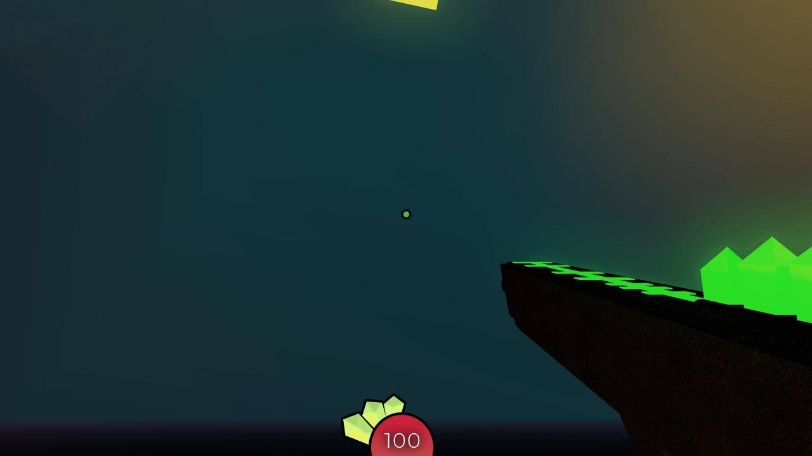
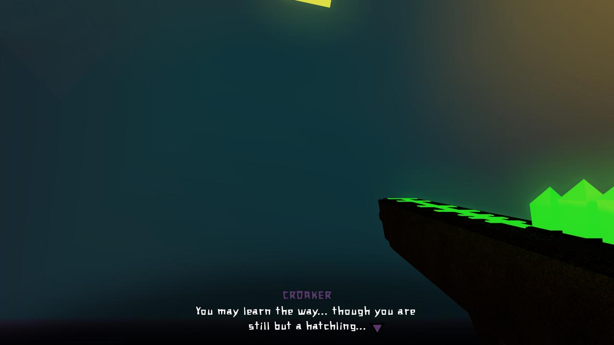
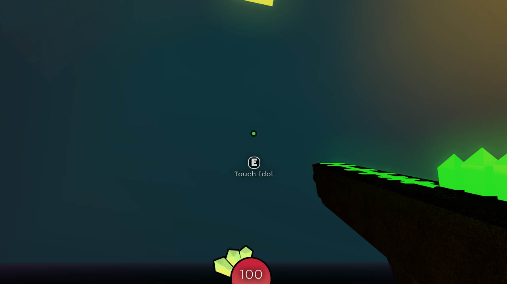
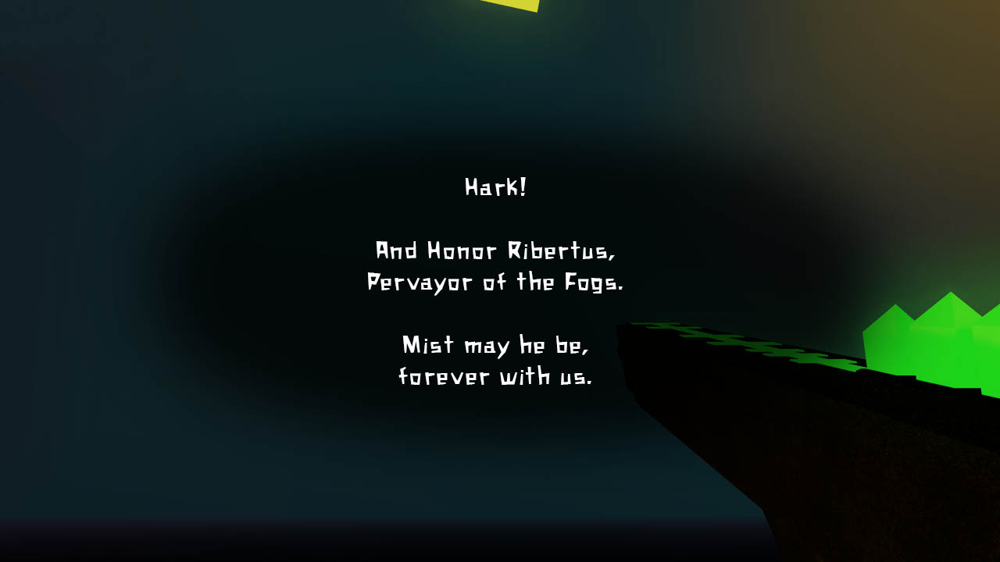

## Movement

Player movement in game is defined as such:

- player can move in 8 directions, sprint, and jump
- whilst sprinting, the player cannot fire the ARC or Throw/Drop a Mystic Egg
- carrying certain Mythic Eggs can affect movement state

## HUD

- HUD can be turned on/off in settings
- HUD opacity can be set (25 - 100%)
- HUD scale can be set (0.25x, 0.5x, 1x, 2x, 3x)
- Health display shows both numeric and depletes vertically downwards to 0
- Charge crystals lose opacity in correlation with the charge of ARC

## Dialogue

- dialogue is only invoked for small moments of exposition
- the player can press their mapped Confirm action or any mouse button to progress the dialogue menu
- Players can set the scale of the dialogue text
- Players can turn off the name display

## Interactions

Throughout the game world the player will come across various statues of the "Frog Gods". These serve as small lore flashpoints and entirely optional. Upon entering a defined radius around the statue, players will be able to press their Interact control map to receive small small flavor text.

